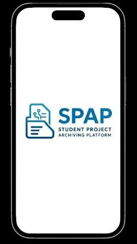
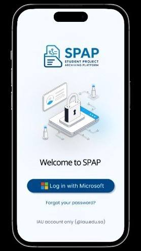
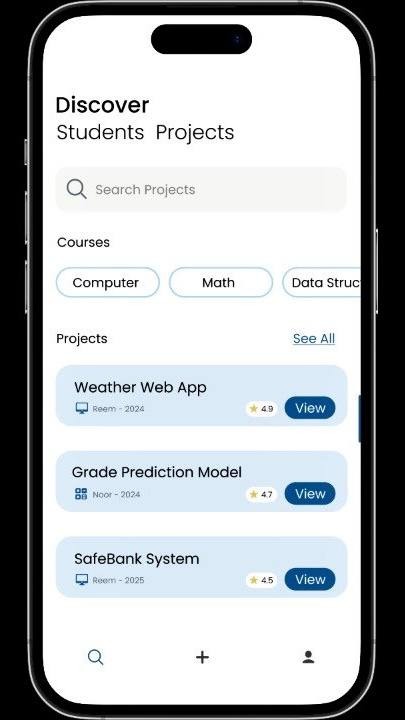
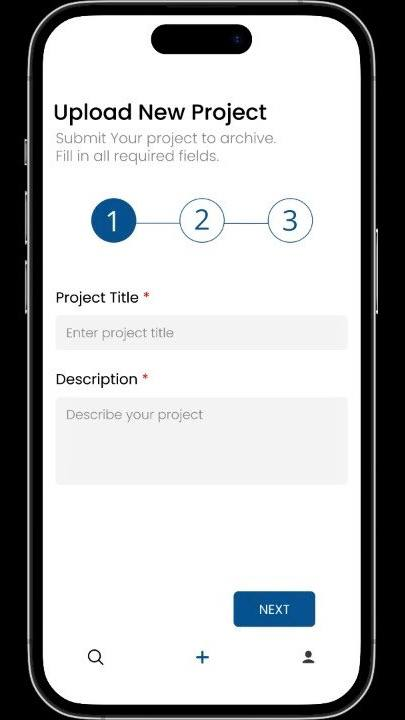
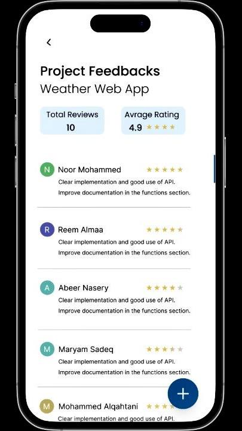
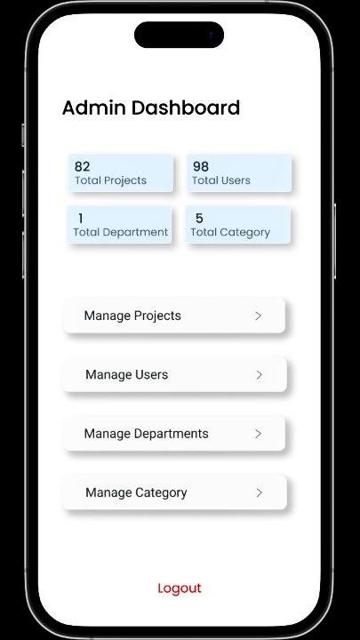

# Student Project Archiving Platform (SPAP)

## 📌 Project Overview

SPAP is a Software Engineering (CS411) course project focused on designing a platform for archiving and managing student projects. The platform provides a centralized space where users can upload, browse, search, and manage academic projects.

The project covered key software engineering stages, including requirements analysis, project planning, system design, documentation, and prototype development.

## 👩🏻‍💻 My Contribution

I contributed to the project throughout its different stages, including project planning, requirements analysis, system design, documentation, and prototype development. I also contributed to the UI/UX design and developed the interactive prototype using Figma.

## 🛠️ Tools

- Figma

## 🔗 Interactive Prototype

[View the Interactive Figma Prototype](https://www.figma.com/proto/jNywTxM7g8T17QYgf2SfLd/SPAP-Prototype?node-id=3-9&p=f&t=IvS4rrtN9KRjEvLS-1&scaling=scale-down&content-scaling=fixed&page-id=0%3A1&starting-point-node-id=3%3A2&show-proto-sidebar=1)

## 👥 User Roles

The SPAP system is designed around three main user roles:

### 🎓 Student

Students can:

- Browse and view archived projects
- Search for projects
- Filter projects by category and course
- Upload and archive new projects
- View their own submitted projects
- View feedback on their projects

### 👨🏻‍🏫 Faculty Member

Faculty members have the core project browsing and submission features available to students, with additional feedback capabilities:

- Browse and view projects
- Search and filter projects
- Upload and archive projects
- View project feedback
- Add comments and feedback
- View their submitted comments
- Edit their own comments

### 🛡️ Admin

The Admin has access to the platform's management functions, including:

- Manage projects
- Manage users
- Manage departments
- Manage categories
- Review submitted projects
- Approve or reject projects

## 🖼️ Prototype Preview

Here are some selected screens from the SPAP prototype.

<table>
   <tr>
    <td></td>
    <td></td>
    <td></td>
  </tr>
  <tr>
    <td></td>
    <td></td>
    <td></td>
  </tr>
</table>

The full SPAP prototype contains over 100 screens, with 26 selected screens included in this repository.

## 📂 Project Type

Software Engineering (CS411) Course Project

## 🤝 Team Project

This project was completed collaboratively as part of a Software Engineering (CS411) course at Imam Abdulrahman Bin Faisal University.
